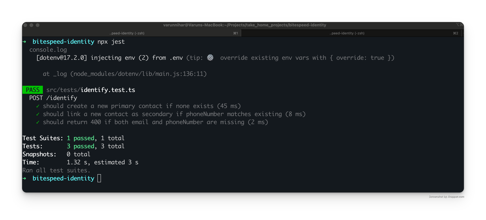
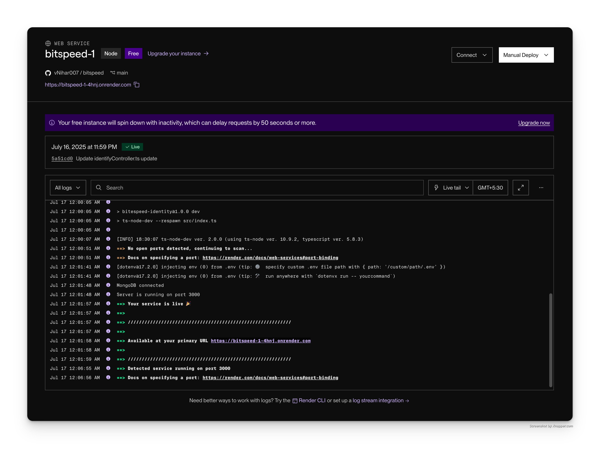

# 🚀 Bitspeed Identity Reconciliation Service

Unify your customer profiles with the **Bitespeed Identity Reconciliation Service**\! This high-performance backend service intelligently links user contacts from various sources using their email addresses and phone numbers. Say goodbye to duplicate contacts and hello to a single, unified view of your customers.

-----

## 🏗️ Architecture Overview

Our service employs a sophisticated identity resolution algorithm to ensure accurate and consistent customer profiles. Here's what it does:

  * **Deduplicates** contact information across multiple data sources.
  * Maintains **hierarchical relationships** between primary and secondary contacts.
  * Provides **real-time contact consolidation** via a robust RESTful API.
  * Guarantees **data consistency** through transactional operations.

-----

## 🛠️ Technical Stack

We've built this service using a modern and powerful set of technologies:

| Component   | Technology   | Version |
| :---------- | :----------- | :------ |
| **Runtime** | Node.js      | 18.x+   |
| **Framework**| Express.js   | 4.x     |
| **Database**| MongoDB      | 5.x     |
| **ODM** | Mongoose     | 7.x     |
| **Testing** | Jest         | 29.x    |
| **Deployment**| Render       | -       |

-----

## Prerequisites

Before you get started, make sure you have these installed:

  * **Node.js** 18.0 or higher
  * **MongoDB** 5.0 or higher
  * **npm** 8.0 or higher

-----

## ⚙️ Installation & Setup

Let's get this service up and running\!

### 1\. Repository Setup

First, clone the repository and navigate into the project directory:

```bash
git clone https://github.com/vNihar007/bitspeed.git
cd bitspeed
```

### 2\. Dependency Installation

Next, install all the necessary project dependencies:

```bash
npm install
```

### 3\. Environment Configuration

Create a `.env` file in the root of your project and add the following:

```env
MONGOOSE_URI=mongodb://localhost:27017/bitespeed
PORT=10000
NODE_ENV=development
```

### 4\. Database Setup

Ensure your **MongoDB** instance is running. You can use a local setup or configure a remote connection string in your `.env` file.

### 5\. Running the Server

Choose your preferred mode to start the server:

  * **Development Mode (with hot reload):**
    ```bash
    npm run dev
    ```
  * **Production Mode:**
    ```bash
    npm start
    ```

-----

## 📝 API Documentation

The core of this service is its powerful **Contact Identification Endpoint**.

### Contact Identification Endpoint

This endpoint processes contact information and returns a consolidated contact profile.

  * **Endpoint:** `POST /identify`
  * **Description:** Processes contact information and returns a consolidated contact profile with all associated identities.
  * **Request Headers:**
    ```
    Content-Type: application/json
    ```
  * **Request Body Schema:**
    ```json
    {
      "email": "string | null",
      "phoneNumber": "string | null"
    }
    ```
  * **Response Schema:**
    ```json
    {
      "contact": {
        "primaryContatctId": "string",
        "emails": ["string"],
        "phoneNumbers": ["string"],
        "secondaryContactIds": ["string"]
      }
    }
    ```

### Usage Examples

#### Example 1: New Contact Creation

If a contact doesn't exist, a new primary contact is created.

```bash
curl -X POST https://bitspeed-1-4hnj.onrender.com/identify \
  -H "Content-Type: application/json" \
  -d '{
    "email": "john.doe@example.com",
    "phoneNumber": "1234567890"
  }'
```

**Response:**

```json
{
  "contact": {
    "primaryContatctId": "64f7b8c9e1234567890abcde",
    "emails": ["john.doe@example.com"],
    "phoneNumbers": ["1234567890"],
    "secondaryContactIds": []
  }
}
```

#### Example 2: Contact Consolidation

When existing contacts are related by email or phone, they are linked, and a consolidated profile is returned.

```bash
curl -X POST https://bitspeed-1-4hnj.onrender.com/identify \
  -H "Content-Type: application/json" \
  -d '{
    "email": "john.doe@example.com",
    "phoneNumber": "0987654321"
  }'
```

**Response:**

```json
{
  "contact": {
    "primaryContatctId": "64f7b8c9e1234567890abcde",
    "emails": ["john.doe@example.com"],
    "phoneNumbers": ["1234567890", "0987654321"],
    "secondaryContactIds": ["64f7b8c9e1234567890abcdf"]
  }
}
```

-----

## 🗄️ Database Schema

The service relies on a flexible **Contact Model** in MongoDB to store and manage contact identities.

### Contact Model

```javascript
{
  _id: ObjectId,
  phoneNumber: String | null,
  email: String | null,
  linkedId: ObjectId | null,
  linkPrecedence: "primary" | "secondary", // Indicates if it's a primary or secondary contact
  createdAt: Date,
  updatedAt: Date,
  deletedAt: Date | null
}
```

### Indexes

We use efficient indexing to ensure fast queries:

  * **Compound index** on `(email, phoneNumber)` for quick lookups.
  * **Index** on `linkedId` for efficient relationship queries.
  * **Index** on `linkPrecedence` for effective primary/secondary filtering.

-----

## ✅ Testing

We've got you covered with comprehensive tests to ensure reliability.

### Running Tests

Execute tests with these commands:

  * **Run all tests:**
    ```bash
    npm test
    ```
  * **Run tests with coverage:**
    ```bash
    npm run test:coverage
    ```
  * **Run tests in watch mode:**
    ```bash
    npm run test:watch
    ```

### Test Coverage

Our robust test suite covers critical aspects:

  * Contact creation scenarios.
  * Identity linking algorithms.
  * Edge cases and error handling.
  * Database transaction integrity.
  * API endpoint validation.

### Tests Passed Screenshot


-----

## ⚡ Performance Considerations

Optimized for speed and efficiency, this service is designed for high-throughput contact processing with sub-second response times.

  * **Database Connections:** Connection pooling is configured for optimal performance.
  * **Indexing Strategy:** Compound indexes on frequently queried fields.
  * **Memory Management:** Efficient object creation and garbage collection.
  * **Response Time:** Average response time is less than 100ms for typical operations.

-----


## 🚀 Deployment

The service is configured for easy deployment, specifically on **Render**.

### Production Deployment (Render)

1.  Connect your GitHub repository to Render.
2.  Configure environment variables in your Render dashboard.
3.  Set the build command: `npm install`.
4.  Set the start command: `npm start`.

**Live Service:** [https://bitspeed-1-4hnj.onrender.com](https://bitspeed-1-4hnj.onrender.com)


### Health Check

You can check the service's health with a simple GET request:

```bash
curl -X GET https://bitspeed-1-4hnj.onrender.com/health
```
###  Render Deployment Screenshot



-----
